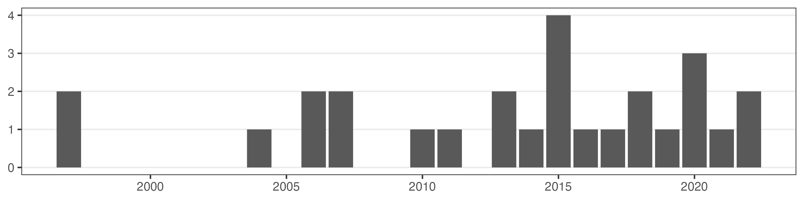
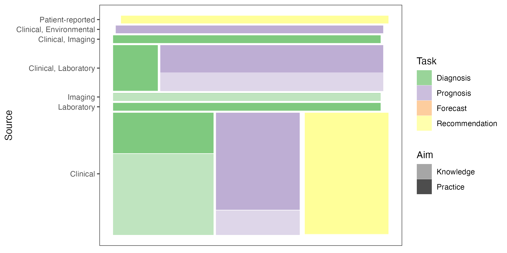
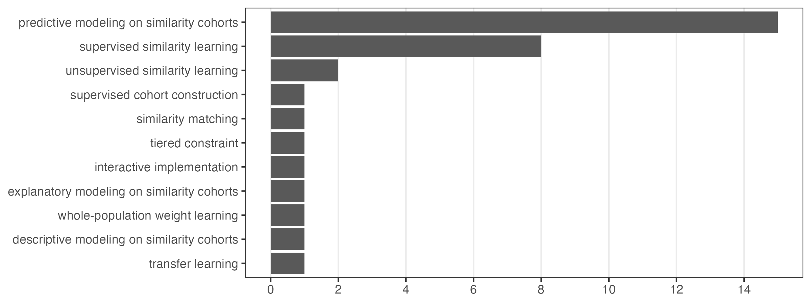
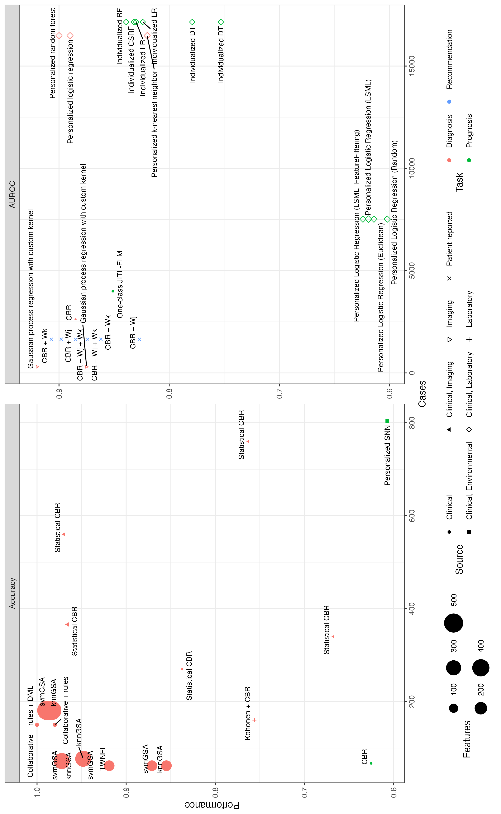

```{r, echo=FALSE, message=FALSE, warning=FALSE}
library(tidyverse)
Sys.sleep(2)
tab_synthesis <- readr::read_rds(here::here("data/synthesis.rds"))
composite_studies <- readr::read_rds(here::here("data/composite.rds"))
framework_specs <- readr::read_rds(here::here("data/framework.rds"))
tab_eval_comp <- readr::read_rds(here::here("data/eval-comp.rds"))
citation_id <- readr::read_rds(here::here("data/citations.rds"))
```

\pagebreak

# Background

A main driver of the development of clinical information systems (CIS) and \hl{clinical decision support systems (CDSS)} has been to leverage the advantages of routinely collected health data toward \hl{improving care }[@Benchimol2015; @Wasylewicz2019].
These advantages include their immediate accessibility through the institutional \hl{electronic health record (EHR)}, billing database, or other source; their specificity to the institution and the population it serves; and the closeness in time of the available data.
\hl{Though not} collected for research use, the secondary research use of routinely collected health data has been put forth, as "practice-based evidence", a complement to the paradigm of \hl{evidence-based practice }[@Sim2001; @Holmqvist2015].

Over the same period of time, interest in individualizing care from population-derived evidence-based recommendations to specific patient needs has driven the application of \hl{advanced computational tools }[@Rosella2022; @Elhaddad2024], including artificial intelligence (AI). Whereas classical models produced formulae involving a limited set of data elements that would be uniformly applied to all patients, AI models often process hundreds or more variables in opaque ways to yield predictions that depend on not only their values but \hl{their associations and interplay with each other }[@Molnar2023]. The loss of straightforward interpretations of these models has limited their practical uptake and motivated the construction of explanatory statistics for opaque models as well as the development of \hl{more interpretable complex models }[@Rudin2022; @Molnar2023].

One of few methodologies to address all three of these established needs is \hl{similarity cohort--based modeling (SCBM)}, which \hl{we find in this review} to have been introduced several times independently under different names, and in slightly different forms.
The approach is a specialized form of case-based reasoning (CBR) that relies on a \hl{patient similarity measure }[@Brown2016] to extract a cohort of past or training cases that then inform the diagnosis, prognosis, or care of a new or test case.[^psm]
\hl{Some of the earliest and simplest CBR tools returned} these retrieved cases \hl{ to inform human decision-making}[@Aamodt1994]; the related nearest neighbors (\hl{kNN}) technique generates predictions from cohorts automatically via averaging (regression) or voting (classification) of their outcomes.
In contrast, \hl{SCBM} fits families of predictive models, for example generalized linear models (GLMs), to retrieved similarity cohorts in order to generate predictions.
\hl{While many ML models come equipped with measures of feature importance and model-agnostic tools can generate explanations for model predictions }[@Molnar2023]\hl{, these quantifications are not directly interpretable model components analogous to the split nodes of a DT or the coefficients of a GLM.
While the patient similarity measure used to retrieve each cohort may be complicated, the cohort itself can be directly inspected.}

\hl{This approach offers an alternative paradigm for interpretable machine learning that combines the simplicity and transparency of classical models like decision trees (DTs) and GLMs with the sensitivity to nonlinearity and interactions of advanced opaque models like random forests (RFs) and artificial neural networks (ANNs). The sensitivity is enabled by the fitting of the model to the local cohort, whose size and scope are governed by hyperparameters that may be tuned like any others via grid or Bayesian optimization. Some similarity measures or other retrieval methods may be more interpretable than others, so that the interpretability of the SCBM approach would then depend on that of its retrieval (similarity matching) and revision (predictive modeling) steps. Moreover, this approach would benefit computationally as well as practically from the availability of a large corpus of cases, as efficient data structures and algorithms exist for similarity matching }[@Halder2024]\hl{ and the local models would benefit from increased numbers of relevant cases.}

[^psm]: Similarity measures between more granular units of analysis, such as encounters and decision points\hl{, or between patients' time series}, are often still referred to as patient similarity measures\hl{ in our sample}.

\hl{Interpretability is often coupled and contrasted with \emph{explainability}.
We follow }@Lisboa2023\hl{ in distinguishing these properties in terms of \emph{ante-hoc} versus \emph{post-hoc} model design and analysis choices, though we note that this usage is not universal }[@Molnar2023]\hl{. Work on explainable ML (or AI) is driven by many of the same needs as interpretable ML, including SCBM, in particular extracting knowledge from routinely collected data and balancing improvements in efficiency and accuracy with user or client comprehension and trust }[@Lisboa2023]\hl{.
However, we find compelling the case that interpretable models are preferable to explainable models when their performance is commensurate, especially for high-stakes decisions, due to the often shallow and fragile insights offered by explainers in comparison to models with transparent and comprehensible structure }[@Rudin2022]\hl{.
This review is driven by our interest specifically in interpretable ML, and by our suspicion that cohort retrieval has more potential for exploratory and predictive modeling of EHR and other routinely collected health data than is yet being exploited.}

\hl{SCBM} harkens to the aspirational "green button" that would, in response to a query, automatically retrieve patient data from an institution’s records with which to conduct on-demand retrospective studies for an individual patient [@Longhurst2014].
Several hurdles face the deployment of such an approach in practice, but its benefits must first be demonstrated.
Our motivations in this scoping review are to describe the settings in and problems with which this approach has been tasked, to attempt to organize them within a common framework, and to evaluate the promise they show toward achieving this or other needs in clinical informatics.
Along the way, we attempt to reconcile terminology, summarize motivations and evaluations, and propose valuable follow-up work.

## Related \hl{survey }work

Clinical CBR emerged among rule-based approaches and other AI tools in the development of expert systems [@Aamodt1994]. Early implementations realized a general workflow described as "the four REs", later the "R4 cycle" [@Aamodt1994; @Begum2011]: Given a new case (or problem), the system _retrieves_ one or more past cases (solved problems) from a corpus, _reuses_ these to generate an understanding of (solution to) the new case, _revises_ \hl{or \emph{adapts}}this understanding (solution) to better fit the new \hl{case,} and _retains_ the new case and its eventual understanding (solution) in the corpus to be retrieved and reused in future. In contrast to rule-based systems, which are variable-based and generally interpretable as a single rule applied to all new cases, case-based systems provide case-specific interpretations in the form of a number of more fully understood reference cases.

@Kolodner1992 distinguished two styles of CBR: _problem-solving_, which is more procedural and used when objectives are more clearly defined, and _interpretative_, which provides categorizations and justifications for possible solutions. A similar dichotomy is commonly used to distinguish the _performance_ \hl{criterion }of predictive models from the _interpretability_ criterion\hl{.}
@Rudin2022\hl{ distinguish \emph{prototype-based} CBR, based on the selection or creation of prototype cases for more efficient matching, from classical \emph{nearest neighbor--based} CBR.}
In these terms, \hl{SCBM}s are \hl{nearest neighbor--based and }highly procedural: The step of fitting a predictive model to a retrieved cohort is an automated adaptive strategy [@Begum2011], and the parameters that govern cohort retrieval can be tuned alongside model hyperparameters in a machine learning (ML) workflow. Accordingly, \hl{SCBM}s have been primarily used for and evaluated on their ability to predict classes or outcomes.
Nevertheless, as \hl{we find in this review}, they can be used to draw inferences about the importance of different risk factors to specific individuals.

\hl{We also note that a large variety of AI tools, besides kNN, use similarity measures or other relevance-based retrieval methods: Back-propagation in ANNs relies on differentiation, which requires that all network nodes' activation functions and, therefore, the final model are continuous and differentiable, i.e. that small distances between cases yield small changes in prediction; and kernel-based methods that rely directly on pairwise distances computed via inner product, rather than high-dimensional coordinates, extend far beyond their use in CBR.
Additionally, }@Schoenborn2021\hl{ survey CBR-powered explanations of opaque models and taxonomize them as \emph{model-agnostic} versus \emph{model-based}, though this coupling of CBR with predictive models is inverted from that of SCBM.
What distinguishes SCBM is that the retrieved cohort is treated as a component of the model and made available to the user. Indeed, retrieval procedures were the most significant algorithmic requirements and accomplishments of CBR }[@Kolodner1992; @Gierl1998]\hl{ and the retrieved cohorts may be reused for numerous modeling tasks.}

We refer the interested reader to several previous reviews of CBR in medicine [@Gierl1998; @Begum2011; @Choudhury2016]\hl{, of CDSS more broadly }[@Wasylewicz2019]\hl{ and of AI-driven systems }[@Elhaddad2024], \hl{of patient similarity measures} [@Dai2020]\hl{, of kNN algorithms }[@Halder2024], \hl{of theory and uses of CBR for} predictive models [@Welch2013; @Sharafoddini2017; @Parimbelli2018; @Badra2023]\hl{, and of recent advances in CBR with emphasis on interpretability and explainability }[@Schoenborn2021; @Rudin2022]. While the reviews of CBR \hl{and CDSS }focus on applications using health data, the \hl{others consider }additional types of data (various molecular -omics, genetic tests, medical images, laboratory tests, patient preferences, patient-reported outcomes, tracking devices, social media) and survey a much broader scope of models (exploratory analysis via dimension reduction and cluster analysis; risk evaluation and outcome prediction\hl{; }software tools).

For the present review, we are interested in how similarity matching on patient-level health data is used to construct local cohorts for predictive or inferential modeling.\hl{ While the similarity measure used in the retrieval step need not be changed as the corpus grows, proposed measures have been diverse, contested, and rarely systematically compared. Moreover, we found no reviews or surveys that focus specifically on the kinds of models we call SCBMs or include detailed comparisons between them.}

## Objectives

Our goals in this review are (1) to describe applications of similarity cohort--based models using patient-level health data and (2) to provide a general framework for the design and evaluation of such \hl{SCBM}s.
We focus narrowly on \hl{SCBM}s, rather than broadly on patient similarity--based clinical decision support tools, so that we may thoroughly assess their value in terms of reported evaluations and comparisons to other methods.
This also allows us to devise a high-level framework that specializes to the majority of these methods, which we then use to frame our discussion and recommendations.

We expected the general framework to come down to three choices: A patient similarity measure, a cohort selection process, and a statistical model family. A general implementation based on this method would allow researchers to expedite every step of the analysis process, including retrieval, optimization, and evaluation, and enable sensitivity, robustness, and multiverse analyses that help identify the most consequential choices along the way.

# Methods

Here we describe our review process, including deviations from plans and the reasons for them.
More details are included in \hl{the Appendix}.

## PRISMA checklist

We include a PRISMA checklist as Supplemental Table 1 and a PRISMA abstract checklist as Supplemental Table 2.
Because we focus on methodologies rather than\hl{ evidence}, we deviate in some ways from PRISMA guidelines. In particular, those items of the checklist involving bias assessment and quantitative synthesis are intended for meta-analyses so did not apply to this study.
Because we are not aware of any standard procedures for conducting reviews and syntheses of methodology, no protocol was prepared for this study.

## Eligibility criteria

\hl{Our selection of relevant papers from the search corpus will be based on the following inclusion/exclusion criteria:}

* \hl{Uses case-level data from a corpus of past cases with known responses}\newline
\hl{(response may be outcome, diagnosis, subtype, etc.)}
* \hl{Defines a numeric multivariate case similarity measure}\newline
\hl{(allow integer-valued measures)}
* \hl{Uses the similarity measure to retrieve cohorts for index cases from the corpus}\newline
\hl{(for example, based on a training--testing partition)}
* \hl{Fits statistical models to cohorts from which to make predictions or draw inferences about index cases}\newline
\hl{(outcome predictions, survival estimates, risk factor contributions, model evaluation statistics, etc.)}

\hl{Note that classical CBR satisfies the first and third criteria by definition and in most cases will satisfy the second.}

## Search

We derived the eligibility \hl{criteria }from a seed set of previously read studies. Based on these criteria, we formulated search strings for five platforms: PubMed, Web of Science, Academic Search Premier, Google Scholar, and MathSciNet. \hl{These platforms were chosen to cover a range of relevant disciplines (biomedicine, mathematics, broader sciences) and types of reports (journal articles, conference proceedings, grey literature.} We finalized the PubMed search first, then adapted it to the other platforms\hl{.}

We conducted all searches over 2021 July 19–22. We tentatively excluded results from Google Scholar because they were missing abstracts, and later agreed to discard these results due to the lack of reproducibility of the search.

We repeated the search on 2024 January 24 on the PubMed and Web of Science databases to bring the results up to date.

## Title/abstract screen

\hl{We} screened titles and abstracts for relevance. We decided on four eligibility criteria to expedite the screening process.
Articles must be written in English, for readability; they must be original studies, to exclude secondary sources with duplicate information; their use settings must be medical, clinical, or related, to keep our review topical; and it must not be clear that their use of our search terms was different from our intended meaning.
Each of two authors (AC and JCB) screened roughly half of the entries. They regularly reviewed each other’s decisions to improve consistency. In cases of uncertainty, entries were included.
For the update, one author (PM) screened all results for \hl{the first }three criteria and another (JCB) screened the survivors for the fourth criterion.

## Full text review

We \hl{used the} 4 criteria\hl{ from Section }\ref{eligibility-criteria} for full-text review\hl{.}

\hl{Two} authors (AC and JCB) independently evaluated each manuscript for these eligibility criteria. The first criterion that a manuscript failed was designated the reason for exclusion. An antecedent criterion was used to exclude manuscripts that did not report the results of original studies involving real-world experiments or empirical data, for example surveys of prior work and proposals of frameworks. In cases of disagreement between the authors on the reason for exclusion, the first criterion was adopted. The authors arrived at agreement on inclusion or exclusion through discussion. We calculated inter-rater reliability to evaluate our screening and review process.

Finally, one author (JCB) applied the same review process to the seed set of 43 studies that inspired the review.
The same author later reviewed the updated results.

## Coding

We next collected characteristics of included studies. The features included bibliographic fields (date of publication, journal, authors, title, keywords, DOI), study goals (objective, generalizable knowledge, evaluation, clinical/medical domain), data sets (data source, type of data, range of data, number of cases/incidences, number of predictors/features), and methodological choices (types of similarity measure, families of adaptation step/statistical model, method(s) compared against, performance measures, results of evaluations and comparisons, name given to modeling approach). We used these data to detect and visualize trends amongst the included studies.

## Synthesis

Rather than an evidence synthesis characteristic of most systematic reviews, we here pursue a methodology synthesis to harmonize largely independent research efforts that have converged on a common family of techniques. The goal will be to describe a unified framework for \hl{SCBM}s that can be used to guide future study designs and implementations as well as more systematically evaluate variations on the theme and measure the dependence of results on modeling choices.

# Results

## Selection

Figure \ref{fig:prisma} depicts our identification of studies via databases and registers. Following the completion and input of each search string, there were a total of 1,817 sources within all of the platforms used. De-duplication resulted in 1,657 entries, which were added to the title/abstract screening for review. Of these, 360 entries met the screening criteria and were assessed through full text review. Of these, 51 fit the original criteria, and 21 were included as distinct from \hl{kNN} prediction.

```{r prisma, fig.align='center', out.width="80%", echo=FALSE}
#| fig.cap =
#| "\\hl{PRISMA-S flow chart.}
#|  Lowercase letters refer to items obtained from
#|  the seed set (m),
#|  the structured search (n), and
#|  citation/reference tracking (s).
#|  Within the structured search results,
#|  summands correspond to original and update."
knitr::include_graphics("Fig1.pdf")
```

From the first search results, there were 60 disagreements over inclusion versus exclusion.
Inter-rater reliability was low, at 82% relative to a 72% probability of random agreement.
Only one author was available to review full texts from the update search.

We then reviewed \hl{a seed set comprising 43 studies} that inspired this review. After removing duplicates and screening for eligibility, we were left with 6 additional studies [@Park2006; @Lowsky2013; @Lee2015; @Ng2015; @Lee2017; @Wang2019], 1 of which was excluded from the synthesis for using \hl{kNN} prediction. Reference tracking from the 43 + 360 = 403 studies assessed for eligibility led us to identify 1 additional study that met our criteria [@Kasabov2010]. This left us with 21 + 1 + 5 = 27 studies included in the review and synthesis.

```{r, echo=FALSE}
stopifnot(nrow(tab_synthesis) == 27L)
```

## Bibliographic and methodological properties

The `r nrow(tab_synthesis)` included studies were analyzed based on several characteristics, and we report and describe some observations here (Table \ref{tab:synthesis}). The studies were published in a variety of journals, with some of greater frequency, though no single journal published more than 3. The journal _Evolving Systems_ published 2 of the included studies, _Artificial Intelligence in Medicine_ published 3, _Hindawi - Journal of Healthcare Engineering_ published 3, \emph{Evolving Systems} published 2, and _PLOS One_ published 2.

Another interesting pattern lay in the years of publication (Figure \ref{fig:year}). While these studies trace back to the late 1990s, they have become \hl{slightly }more common, which suggests that this is an active, though not rapidly expanding, approach. We note that CBR in health and medicine originated as early as 1990, and \hl{SCBM} emerged soon after CBR had established itself; the idea has been "in the air" for as long as CBR has been in use. \hl{ Based on the motivations and methodologies observed in our sample (discussed in later sections), we speculate that the higher frequency of studies since 2013 is attributable in large part to the availability of vaster clinical databases with improved pre-processing tools, following the rapid uptake of EHRs; and of more efficient and powerful tools for retrieval (similarity-matching), the traditional bottleneck of CBR. Another possibility is an increased interest in interpretable machine learning }[@Rudin2022]\hl{. Each of these factors should apply with no less force to other CDSS and clinical applications of ML, and the rise we see may simply be commensurate with an overall increase in the volume of articles in these fields.}

\small

```{r tab:synthesis, echo=FALSE, message=FALSE, warning=FALSE}
tab_synthesis |> 
  # combine citations of the same study
  left_join(citation_id, by = "Citation") |> 
  group_by(across(c(-Number, -Citation, -Date))) |> 
  summarize(Date = min(Date), Citation = str_c(Citation, collapse = "; ")) |> 
  ungroup() |> 
  arrange(Date) |> 
  select(Citation, Task, Aim, Source, Type, Cases, Features) |> 
  # format citations for Markdown-LaTeX
  # mutate(Citation = str_c("[@", Citation, "]")) |> 
  mutate(Citation = sapply(
    str_split(Citation, "; "),
    function(s) str_c("@", s, collapse = "; ")
  )) |> 
  # allow text wrapping
  mutate(Task = ifelse(Task == "Recommendation", "Recommend-ation", Task)) |> 
  # prevent numeric list columns from dominating the horizontal space
  mutate(across(
    c(-Citation, -Cases, -Features),
    ~ str_c(., "\\hspace{6em}")
  )) |> 
  knitr::kable(
    align = "lllllrr",
    caption = paste0(
      "\\label{tab:synthesis}",
      "\\hl{Studies included in the method synthesis,",
      " arranged by the earliest the study is known to have been public.}"
    )
  )
```

\normalsize

```{r year, fig.align='center', out.width="100%", echo=FALSE}
#| fig.cap =
#| "Number of publications in our sample each year."

```

Another dominant characteristic of included studies is their broader remit. We categorized studies as "knowledge" or "practice" based on whether their aim was to produce generalizable knowledge or to improve practice. We classified `r tab_synthesis |> filter(Aim == "Knowledge") |> nrow()` of the studies as "knowledge", making the majority of studies from a "practice" standpoint. These studies aimed to provide tools for use in clinic or to improve outcomes.

\hl{Most studies used clinical data elements alone
(`r tab_synthesis |> filter(Source == "Clinical") |> nrow()`),
and most of the remainder used these in combination with laboratory
(`r tab_synthesis |> filter(str_detect(Source, "Clinical.*Laboratory")) |> nrow()`),
imaging
(`r tab_synthesis |> filter(str_detect(Source, "Clinical.*Imaging")) |> nrow()`),
or environmental
(`r tab_synthesis |> filter(str_detect(Source, "Clinical.*Environmental")) |> nrow()`)
data. The data source was related to the modeling task, for instance in that all decision support models used either clinical or patient-reported data.
The mosaic plot in Figure }\ref{fig:properties}\hl{ summarizes the relation between data source, clinical task, and aim.}

Lastly, we observed a commonality among 6 of the included studies in having evaluated methods using leave-one-out cross-validation (LOOCV). The purpose of this measure is to estimate the overall performance of certain factors when used to make predictions, particularly utilized on smaller data sets, where models benefit greatly from larger training sets and additional model fitting is less costly.

In addition to the aim of its analysis, we coded several aspects of the design of each study, including the source and type of data and the clinical task the model performed (Table \ref{tab:synthesis}), as well as the specific methodology and terminology adopted (Table \ref{tab:composite}).
In the following subsections, we take a closer look at these design elements and their reported justifications and limitations.

## Application domains

While all included studies were reported in scientific and medical journals, the vast majority were oriented toward clinical practice rather than medical research. For example, a 2006 study specifically evaluated the usefulness of CBR-based explanations for the purpose of decision support [@Doyle2006]. This study was part of a much larger literature on CBR systems and was included here despite relying on \hl{kNN} prediction because it used an unconventional voting scheme to generate recommendations. A more recent study took essentially the same focus with respect to a proposed clinical risk prediction model, which amounted to CBR with a novel weighting scheme on predictors informed by expert consensus [@Fang2021]. In both cases a prototype implementation was \hl{evaluated} in an experimental \hl{setting.}

The most common clinical motivations were individualized detection or diagnosis, prognosis or outcome prediction, and treatment or care recommendation. The plurality focused on prognosis or outcome prediction, often using time-to-event analysis: @Mariuzzi1997 used CBR to predict survival time from several geometric properties of breast tumors. @Lowsky2013 used CBR with non-parametric survival models on registry data to predict patient–graft survival times following kidney transplantation. @Lee2015 and @Lee2017 used localized \hl{GLM} and RF modeling to predict 30-day mortality following discharge for ICU patients. @Vilhena2016 developed a CBR cycle around a clustering-informed similarity matching procedure and an \hl{ANN}–based classifier to identify thrombophilia patients at high risk of thrombotic episodes. @Ma2020 took a similarity cohort–based approach to predicting length of stay for ICU patients. @Doborjeh2022 localized spiking \hl{ANN}s in order to assess stroke risk from up to 7-day time series of clinical and environmental factors. @Liu2022 incorporated global-to-local transfer learning into \hl{SCBM}s of acute kidney injury risk in hospitalized patients. Also of note, from a public health perspective, @Xu2008 used CBR to predict rehabilitation time as well as disability risk for unemployed workers experiencing chronic pain.

Toward detection and diagnosis, @Wyns2004 proposed a hybrid neural net–CBR system to distinguish (with confidence bounds) arthritic versus control patients, based on several histological features. @Nicolas2014 used collaborative multilabel CBR to subtype melanoma patients based on confocal and dermoscopy images. @Wang2019 used \hl{SCBM}s built from a multi-type additive similarity measure to distinguish type 2 diabetic versus control populations. Along the way, @Song2006, @Kasabov2010, and @Verma2015 took an iterative model-building approach to several tasks: predicting glomerular filtration rate, a key indicator of renal function, from demographic and physiological variables; identifying patients with colon cancer using a large number of gene expression measurements; and identifying patients with type 2 diabetes based on demographic, physiological, and genetic variables.

While several studies emphasized the potential or actual value to decision-making of their methods and tools, only one incorporated treatment decisions into their approach: By taking "decision points" as their units of analysis, @Tang2021 and @Ng2021 built not classifiers or predictors but comparative effectiveness models into a localized framework, providing for the first time in our sample explicitly prescriptive rather than descriptive clinical decision support.

A partial exception to this focus was a 2014 study that also reported a decision support tool, in this case for early diagnosis of melanoma from clinical data and dermoscopy images [@Nicolas2014]. While the stated objectives were analogous, specific emphasis was placed on the acquisition of new knowledge through the development of the tool, including the systematic generation of new data and creation of a clinical ontology. This study was included for its use of a collaborative classifier that drew from multiple modeling approaches. In keeping with this focus of the included literature, the stated objectives of the proposed methods were more often (or additionally) to predict outcomes or to recommend interventions than only to diagnose disease.

```{r properties, fig.align='center', out.width="100%", echo=FALSE}
#| fig.cap =
#| "\\hl{Share of studies characterized by several design elements:}
#|  data source (row),
#|  clinical task (fill), and
#|  remit (opacity)."

```

## Challenges\hl{ faced}

CBR can be understood as the opposite side of a trade-off with rule-based reasoning between model size and model complexity: @Doyle2006 describe their approach as "knowledge-light", in that "the cases do not contain explicit explanation structures; instead, explanation is achieved by comparison of the query case with retrieved cases". This means that the greatest performance and efficiency challenges in CBR have to do with the retrieval and revision phases in the R4 cycle. Several studies addressed these challenges: @Park2006, while excluded from the synthesis, were the earliest to propose that cohorts be bounded by a similarity threshold rather than by the number of cases, which improved performance in their experiments. @CampilloGimenez2013 leveraged predictor weights obtained from logistic regression to inform the similarity calculation used in retrieval. @Lowsky2013 used non-parametric models to reduce the computational burden of revision (prediction). @Ma2020 proposed to improve efficiency along the entire R4 cycle, but in particular by only executing task-dependent steps in real time ("just-in-time learning", JITL), and @Ng2021 and @Tang2021 partitioned multiple phases in the R4 cycle into offline and online components, only the latter of which would be performed in real time as new data are received.
@Liu2022 used transfer learning from globally-fitted models to improve the efficiency of \hl{SCBM}s.

Other studies addressed limitations of available tools. @Lopez2011 implemented a comprehensive CBR tool in response to the lack of general-purpose software, to enable coupling with other tools as well as to expedite development, experimentation, and uptake. Several other teams also set out to develop more generalizable and data-agnostic clinical support tools [@Elter2007; @Liang2015; @Ng2015; @Zhang2018].
However, more informatical and legal challenges to implementation, including interoperability of systems and data and regulations concerning security and privacy, were rarely addressed.
We discuss this further in Section \ref{future-work}.

Figure \ref{fig:methods} compares the rates at which several methodological elements are invoked in the sample.

## Evaluations

Most included studies quantitatively compared the predictive performance of their proposed method(s) to one or more comparators. What we took to be the signature results are collated in Table \ref{tab:performance} in the Appendix. Note that we exercised some judgment in classifying methods as proposals and comparators, as in some cases all methods were original but only some showcased main ideas.
It would be impractical to meta-analyze these numbers due to the great variety of settings, problems, data types, techniques, and choices involved.

We do observe one clear pattern: All of the proposed methods that most evidently outperformed their comparators---Kohonen + CBR [@Wyns2004], TWNFI [@Song2006; @Kasabov2010], gravitational search algorithms (GSA) [@Liang2015], CBR + rules (+ DML) [@Nicolas2014], Gaussian process regression [@Zhang2018], JITL-ELM [@Ma2020]---are hybrids of \hl{SCBM} (in some cases CBR) with other techniques, often DML. Though @CampilloGimenez2013 and @Ng2015 report non-superior performance by such hybrids, the pattern suggests the importance of the similarity measure to the retrieval step.
Meanwhile, when proposed approaches targeted cohort demarcation or choice of predictive model---statistical CBR [@Park2006]; individualized \hl{GLM, DT, and RF} [@Lee2015; @Lee2017]---they did not consistently outperform comparators.

\hl{Figure }\ref{fig:performance}\hl{ visualizes the relationship between performance and case count, feature count, data source, and predictive task for those experiments that evaluated models using accuracy or AUROC (other performance measures were too rare to allow for useful comparisons).
While not represented in the plot, results from different models applied to the same data can be inferred from their common case counts, data sources, and tasks.
The data are too heterogeneous to meaningfully test for trends. Performance varies much more between experiments than between models within experiments, and there is no clear dependency on the source(s) of data or on the type of prediction.
We also note that the plot is no less consistent with the alarming negative association between sample size and reported accuracy observed by }@Berisha2021\hl{ than with the inverse association expected in the absence of selective reporting.}

## Identified needs

\hl{S}tudy authors focused their recommendations and \hl{future plans} mostly on technical improvements and evaluations\hl{.}
Urged improvements included full or partial automation of predictor selection [@Mariuzzi1997; @Yearwood1997], similarity learning [@Mariuzzi1997; @Wang2019], and parameter optimization [@Song2006; @Lee2017]; extensions to new data structures [@Lopez2011], data types [@Liang2015; @Verma2015; @Malykh2018], and reasoning systems [@Nicolas2014]; and the use of more advanced model components to improve accuracy or efficiency [@Lowsky2013; @Lee2015; @Liang2015; @Zhang2018].
Authors also urged validations and independent evaluations using larger or more comprehensive data sets [@Elter2007; @Xu2008; @Verma2015; @Ng2015], using data aggregated from multiple health systems [@Lee2015; @Lee2017; @Tang2021; @Ng2021], and in other care settings or disease contexts [@Song2006; @Zhang2018; @Tang2021; @Ng2021].
\hl{That said, s}ome authors urged the incorporation of (human-derived) domain knowledge into the data or models [@Yearwood1997; @Wang2019]\hl{, and o}thers suggested new uses of their \hl{methods} to measure feature importance [@Wyns2004], to make models more expressive [@Lee2015], and to combine information obtained both from global and from \hl{SCBM}s [@Ng2015].
\hl{(}Most of this incremental work was indeed carried out \hl{later} in our sample.\hl{)}

# \hl{Discussion}

After commenting briefly on our review process, we draw several observations from our encoding of the included studies.
We first focus on their methodological choices and innovations, then on their conventions and language.
We spend most of the section discussing the differences and commonalities of the techniques used, toward a general method that encompasses most or all cases.
We then suggest some avenues for future studies and conclude with our key takeaways.

## Process

The low inter-rater reliability was due, in parts, to different interpretations of some eligibility criteria by the authors, inconsistent terminology across the sample, and incomplete reporting of resources and methods in the sample. Regarding interpretation of criteria, some wording of the criteria was adjusted following discussions between the reviewing authors during full-text review to better specify an agreed-upon meaning. \hl{We }discuss the different domains, terminologies, and reporting issues of the sample in the remainder of this section.

## Study designs

Consistent with their orientation, almost all included studies were conducted using clinical data, only occasionally together with patient-reported (2), laboratory (3), image (1), and environmental (1) data. We suggest three reasons for this: First, this literature traces back to the 1990s, before -omic data could be generated cost-effectively at scale. Second, CBR in particular has a strong tradition in clinical decision support, where the focus of our sample remains throughout the review period. Third, because most -omic data are highly homogeneous—all measurements are made along or can be transformed to a common scale, e.g. greyscale pixellations for X-ray images and transcripts per million for RNA-seq data—more deeply theoretical analysis techniques have been developed and come into wide use. While variations on correlation-based approaches like EHR-based phenome-wide association studies and similarity-based methods like CBR itself have been developed, more mechanistic and probabilistic tools have not become a domain standard.

## Coherence

The motivational and methodological unity of these studies does not reflect a unified research program. Besides the lack of any primary journal of record, we observed collaborations only among the authors of smaller contiguous programs, including applications of the TWNFI methodology [@Song2006; @Verma2015], individualized mortality prediction for ICU patients [@Lee2015; @Lee2017] and the use of more explanatory models to prioritize predictors or treatments for chronic disease [@Ng2015; @Tang2021; @Ng2021].

## Synthesis

The 27 studies included in our synthesis used composite techniques that we organized into two major types. One type, _similarity learning_, was used in 8 studies that tie in to the much larger literature on DML [@Yang2006].
The other, _cohort thresholding_, focused on choosing or optimizing the manner in which cohorts were demarcated using the similarity measure.

### Similarity learning and threshold optimization

\hl{Eight} studies used response values in training data sets to supervise similarity learning while two used unsupervised learning (Table \ref{tab:composite}). Based on the key properties of DML algorithms identified by @Bellet2014, most learned measures were non-linear while some were locally learned, and some were optimized globally while others locally. Not all qualified as DML, since the resulting measures would not necessarily satisfy the triangle inequality. Each used its similarity measure to retrieve training cases relevant to each testing case. \hl{Most} took a standard \hl{kNN} approach to generating predictions; \hl{two} [@Vilhena2016; @Tang2021] fit predictive models to the retrieved cohorts.

Several studies used unsupervised similarity learning, for example the Mahalanobis distance [@Lowsky2013] and the Kolmogorov entropy-based distance [@Elter2007]. In particular, @Yearwood1997 defined similarity as a weighted sum of differences in predictor values and used linear regression to optimize the weights for the predictive accuracy of the cohort they retrieve. Others used supervised learning: @Song2006 proposed an iterative algorithm to optimize a set of fuzzy inference rules used to retrieve relevant cases and generate a prediction, using back-propagation on the rules’ parameters. Their method was used in several later studies returned by our search, which are not discussed here because they did not originate the technique. @Nicolas2014 explicitly appeal to a supervised distance metric learning (DML) technique [@Xing2002] to obtain a similarity measure on their set of dermoscopy and confocal images that most effectively separates malignant from benign melanoma tumors. We will discuss the remaining uses of supervised similarity learning shortly.

Distinct from but related to similarity learning was supervised cohort construction. This was an adaptive step taken by @Park2006 to optimize the predictive performance of models fitted to cohorts retrieved using a fixed similarity rather than count threshold, a counterpart to conventional CBR they called "statistical CBR".[^combinatorial] The step used a heuristic procedure to locate a similarity threshold that (locally) maximizes predictive accuracy on the training set. This is analogous to optimizing the neighborhood size parameter in \hl{kNN} predictive modeling, so we will not discuss it further except to mention that the authors found statistical CBR to outperform conventional CBR on several data sets. @CampilloGimenez2013 combined these learning techniques: They used logistic regression on the training set to obtain weights for the predictors (by predicting the binary outcome of kidney transplant waitlist registration) and for the cases (by predicting agreement of outcome between an index case and other training cases), and they used exhaustion to optimize the size of the retrieved cohort for the accuracy of the \hl{kNN} model using the previously optimized weights.

[^combinatorial]: Drawing from @Goyal2008, we suggest the term "combinatorial CBR" for the then-conventional approach using similarity cohorts of fixed cardinality.

### Localized models

\hl{Seven} other studies employed localized models: @Mariuzzi1997, @Lee2015, @Verma2015, @Wang2019, @Ma2020, @Liu2022, and @Doborjeh2022. \hl{Most} models were purely predictive\hl{, though} @Mariuzzi1997 produced purely descriptive models of survival outcomes, which were evaluated for their precision rather than their accuracy, while @Ng2015 used generalized regression models descriptively as well as predictively, as did @Tang2021, @Ng2021, and @Liu2022\hl{.} The most common approach to cohort selection was to optimize a size threshold via manual exploration [@Mariuzzi1997; @Lee2015; @Ng2015; @Lee2017; @Wang2019; @Vilhena2016] or via cross-validation [@Lowsky2013; @Verma2015]. \hl{One} study [@Ma2020] set a fixed cohort size while two [@Liang2015; @Tang2021; @Ng2021] devised more sophisticated algorithms to balance multiple desiderata including predictive accuracy.

\hl{One theme} was the optimization of retrieved cohort sizes for some measure of model performance. Despite the early recommendation by @Park2006 to threshold cohorts by similarity rather than by cardinality, only the one previously published study [@Mariuzzi1997] and the most recent study [@Tang2021; @Ng2021] in this corpus took this approach, though @Liu2022 took a third option by retrieving fixed proportions of training data. Viewed as a hyperparameter of the individualized modeling approach, cohort size can be treated in the same way as neighborhood size in \hl{kNN} \hl{prediction}, so we will not discuss it further.

@Kasabov2010 proposed an iterative algorithm to settle on an optimal number and set of predictors as well as number of training cases (comprising the retrieved cohort) that was later used by @Liang2015. More recently, @Tang2021 and @Ng2021 proposed a three-step process for cohort selection that filtered by exact match for one subset of predictors, used domain-informed similarity measures to rank these, and optimized the similarity threshold for a trade-off between cohort size and a measure of bias called cohort balance. \hl{T}hough their similarity measure was supervised, this optimization process was not.

With the exception of the descriptive survival models of @Mariuzzi1997, only one thread in this corpus \hl{concerned the} interpretability of localized models: @Ng2015 fit logistic regression models to similarity-based cohorts and examined not only their predictive performance but the localized sets of largest and most detectable predictors, termed risk profiles, and how they differed across the testing population. This approach informed their later use of localized comparative effectiveness–style models to recommend courses of treatment at decision points during a monitored patent’s stay [@Tang2021; @Ng2021], and it was later used by @Liu2022 to show a dependency of predictor importance on the patient disease subgroup. These studies suggest \hl{wider} potential for localized real-world evidence generation, which has long been promoted as a promise of advances in clinical and health informatics [@Longhurst2014].

### A general framework

This relatively small sample exhibited a wide range of \hl{designs in both the assembly of pre-processing, retrieval, reuse, and interpretation steps and the specific tools deployed at each}. Discussion of the \hl{diversity} of \hl{tools} has been summarized above and published in greater detail in previous reviews [@Choudhury2016; @Sharafoddini2017; @Parimbelli2018]\hl{. In this section, we focus on the diversity of assemblies. These depend on} three largely independent choices \hl{(Figure }\ref{fig:framework}\hl{)}: (1) how to measure the similarity between cases, (2) how to retrieve a cohort of cases similar to an index case, and (3) how to generate a prediction or other statistical insight for the index case from the similarity cohort.

```{r framework, fig.align='center', out.width="100%", echo=FALSE}
#| fig.cap =
#| "General framework for localized models.
#|  Dashed arrows indicate optional steps."
knitr::include_graphics("Fig5.pdf")
```

Each step can be unsupervised supervised: Unsupervised similarity measures include \hl{the} Levenshtein distance and \hl{cosine} similarity, while supervised measures include the Mahalanobis distance and \hl{RF} proximity as well as several composite measures with weights calculated from the data. Most retrieval steps obtained cohorts with a uniform size (cardinality) or similarity threshold, and the remaining were likewise only informed by predictors; thus, while a retrieval step could in principle be supervised, in this sample none were. Almost all models were supervised, being that most performed predictive tasks, though @Mariuzzi1997 modeled only survival rates within localized cohorts. Meanwhile, each step can be optimized in a ML fashion by having its parameters tuned to improve performance. We found one study that tuned the calculation of similarity [@Liu2022], though most uniform cohort sizes were also tuned. Some earlier studies tuned generalized regression models, but more recent studies did not.

\hl{As in the case of data and, recently, of ML models, having a standardized general framework facilitates the recombination of ideas and prevents duplicate effort as well as supporting more comprehensive and efficient work [@Ravi2022]. A SCBM implementation based on this framework would help investigators systematically compare predictions and other output obtained using different tools for cohort retrieval and predictive modeling, as well as tune the parameters governing these tools. It would also make like-kind comparisons of performance easier on different tasks using different data sets and expedite validation studies. This would address the core technical needs expressed in our sample (Section }\ref{identified-needs}\hl{) as well as the limitations of our own comparison of reported performances (Section }\ref{evaluations}\hl{).
We also believe that this framework could be used to make the diversity of possible approaches more comprehensible to users, enabling them to most appropriately tailor these decisions to their tasks.}

\small

```{r tab:framework, echo=FALSE, message=FALSE, warning=FALSE}
framework_specs |> 
  mutate(
    Citation = sapply(
      str_split(Citation, "; "),
      function(s) str_c("@", s, collapse = "; ")
    )
  ) |> 
  # mutate(Citation = str_c("[", Citation, "]")) |> 
  # prevent numeric list columns from dominating the horizontal space
  mutate(across(c(-Citation), ~ str_c(., "\\hspace{18em}"))) |> 
  knitr::kable(
    align = "llll",
    caption = paste0(
      "\\label{tab:framework}",
      "Specializations of general framework to included studies.",
      " Flags: R = recurse\\hl{d}, S = supervised, T = tuned (optimized)."
    )
  )
```

\normalsize

## Future work

\hl{We suggest four avenues for future work: evaluation of predictive performance, usability and interpretability, practical and regulatory feasibility, and customizability.}

\hl{Most studies were premised on the potential predictive value of localized models (Appendix), but not all experiments affirmed this premise (Section }\ref{evaluations}\hl{). Those that did mostly used DML to improve retrieval and sometimes iteratively optimized the metric and the model.
However, even those that showcased several such specializations }[@CampilloGimenez2013; @Ng2015; @Zhang2018; @Liu2022]\hl{ mostly used their own precursors or commonplace alternatives as comparators. Future work should compare competitive alternatives to assess their performance and other trade-offs.
This work would be aided by standardization and modularization using a framework like that outlined above.
For example, }@CampilloGimenez2013\hl{ and }@Liu2022\hl{ use a modular design to toggle multiple choices and obtain neatly nested comparisons.}

\hl{While most studies identified outstanding technical needs (Section }\ref{identified-needs}\hl{), few (though some) emphasized the need to assess interpretability, meaningfulness, or trust.
Most studies identified interpretability as an advantage of localized models, though none evaluated model interpretability and few proposed new interpretative uses.
Lack of trust in ML tools is a long-recognized problem that direct intepretability of model components could help alleviate.
One valuable direction for future work would be to measure the utility of interpretable components in research and in clinical practice and the correctness and confidence of users in their interpretations.
Another would be to compare the localized predictor importance measures obtained from localized models to the local importance measures used to explain predictions made by opaque models.}

\hl{Much of the reviewed work was motivated by the need for modeling paradigms that perform well on a variety of tasks and in a variety of settings.
Such software architectures must be robust, versatile, and compliant in the face of diverse data models and use restrictions.
SCBM is susceptible to these challenges, as corpora of past cases must be aggregated from multiple institutions and from multiple systems within institutions, and models built on them must then be applicable to out-of-box data structures.
Individual systems exhibit many dimensions of incompleteness }[@Weiskopf2013]\hl{ and vary along other dimensions of quality }[@Kohane2021]\hl{, and their aggregation for modeling purposes depends on several kinds of interoperability }[@Weber2015]\hl{.
Successful deployment also depends on satisfying regulatory regimes designed to protect the privacy of patients, the security of communications, and trust between parties }[@Haendel2021]\hl{.
Future work may therefore eventually need to directly address the challenges of system interoperability and regulatory requirements.}

\hl{From a functionalist approach to reproducibility }[@Matarese2022]\hl{, later studies were broadly successful at reproducing earlier studies, and later studies provide sufficient detail to support ongoing reproduction efforts---though these might be limited by the lack of open-source code or public implementations.
However, the immediate goal of most studes was to improve care.
We expect that this practical utility will depend on the ability of the user community to exert control over certain inputs, components, and behaviors of the models.
For one example, a user may want to minimize the weight of rare diseases in medical history in order to retrieve a population with more such cases in order to better measure their associated risk to the outcome. In contrast, they may want to increase the weight of the indicating diagnosis in order to allow fewer patients from similar but distinct populations to influence the model. Alternatively, a user may want to down-weight socioeconomic variables like race--ethnicity in order to ensure a more diverse modeling cohort.
}@Lopez2011\hl{ took an important step in this direction with an adjustable and adaptable implementation.}

## \hl{Conclusion}

We conducted a systematic search for studies that \hl{systematically fit parameterized models to similarity-based cohorts pursuant} to tasks involving \hl{medical and }health data\hl{. }While the search \hl{strategy showed serious limitations}, the included studies used many of the same underlying tools to build, optimize, and evaluate their methods. \hl{We synthesized these largely independently developed approaches into a general framework that we believe} can serve to taxonomize ongoing \hl{work }and inform \hl{future development}. Indeed, the availability of increasing computational power\hl{ and} the diversity of tasks to which these models were applied and of technical specifications they \hl{employed suggest }potential for growth. \hl{Whereas} few of the reviewed studies used these models for any task other than prediction, despite widespread suspicion among clinicians of "black-box" models and growing interest in interpretable alternatives, we recommend that future work \hl{emphasize the} validation of interpretable localized models \hl{and their accessibility to} communities of medical research and clinical practice.

# List of abbreviations {-}

* CBR: case-based reasoning
* CIS: clinical information system
* \hl{CDSS:} clinical decision support\hl{ system}
* AI: artificial intelligence
* \hl{kNN}: nearest neighbors
* GLM: generalized linear model
* \hl{DT: decision tree}
* \hl{RF: random forest}
* \hl{ANN: artificial neural network}
* ML: machine learning
* PMC: PubMed Central
* LOOCV: leave-one-out cross-validation
* GSA: gravitational search algorithm
* DML: distance metric learning

# Declarations {-}

## Ethics approval and consent to participate {-}

Not applicable.

## Consent for publication {-}

Not applicable.

## Availability of data and materials {-}

Search results, included studies, and other cited sources are publicly available in a Zotero group library:
<https://www.zotero.org/groups/5017571/imsr/>

Data collected or encoded for included studies are publicly available in two Google Sheets:

* Bibliographic and methodological properties of included studies: <https://docs.google.com/spreadsheets/d/1tpWMhYH2pyRT55K7n2J2XFs-kEV_JTuCDmXzJ4BBgNo/>
* Terminology and composite techniques of included studies: <https://docs.google.com/spreadsheets/d/1xvDJwiLBoI2oz8fxHJ5MjNmiju_RAlK7RJv-wXe1DAs/>

Code used to analyze these data and prepare this manuscript is publicly available in a GitHub repository:
<https://github.com/corybrunson/imsr>

## Competing interests {-}

The authors declare that they have no competing interests.

## Funding {-}

Not applicable.

## Authors' contributions {-}

JCB conceived of the study.
All authors contributed to the study design---search, screen, review, and synthesis.
AC and JCB conducted the search, screen, review, and synthesis (coded and analyzed bibliographic and methodological data).
AC and JCB drafted, and all authors contributed to, read, and approved, the manuscript.

## Acknowledgements {-}

\hl{Four} anonymous reviewers provided valuable feedback on \hl{previous versions} of this manuscript.

\pagebreak

# Appendix {-}

## Research question {-}

How is patient similarity–based individualized modeling conducted using retrospective data?

## Purpose of review {-}

1. Provide a summary of individualized models to date.
2. Lay the groundwork for conducting a comparison study of individualized models.
3. Provide a framework for future individualized modeling studies.

## Search design {-}

The procedure for formulating the search began with an evaluation of the research question. We highlighted specific elements within our topic of interest that we found critical to our search and listed them using an OR of ANDs, pairing terms we believed would provide our desired result. Following the solidification of the search, a thesaurus was created in which each term was expanded by synonyms that are similar enough to our core term to be applicable to our search. The expanded search string was then evaluated using the PubMed Advanced Search platform. We initially included each term and their synonyms separately to evaluate what resulted. Several terms were eliminated due to PubMed classifying them as “phrases not found” and other terms were removed to reduce the number of results, providing a more concise list of results. At the conclusions of this process for each individual term, we combined each search term using an OR of ANDs to ultimately form our search.

The search \hl{was} designed to recover studies of the kind reviewed by the review papers from which we obtained our “seed set”. To validate the final search design, we \hl{determined} how many of the papers in this seed set that are indexed by PubMed are actually recovered by our search. In most cases, the focus of a review paper is different from ours, so we will only perform this validation test on the seed set obtained from two review papers that are (a) closest in focus to ours and (b) use terminology associated with the two distinct sub-literatures relevant to our focus: Choudhury & Begum (2016), which focuses on case-based reasoning in medicine, and Sharafoddini, Dubin, & Lee (2017), which focuses on patient similarity–based prediction models on health data. The proportion of each PubMed-indexed seed set \hl{recovered} from our PubMed search provides a rough and optimistic yet useful estimate of the proportion of the relevant literature that our full search strategy will recover.

Once we \hl{finalized} the search as a logical pattern, we \hl{took} the following steps to generate the sample/corpus of literature that \hl{was} the starting point for our selection process.

1. The logical pattern will be converted to a search string using the syntax appropriate to each database in our search strategy. These include\hl{d} PubMed (already done as part of the search design), Web of Science, Academic Search Premier/Elite, and Mathematical Reviews.
2. The search \hl{was} conducted on each database and the results organized into a Zotero collection, with one subcollection for each database.
3. Duplicate results \hl{were} identified and merged. (A result obtained from multiple databases should have only one Zotero entry but should be filed under the subcollection for each database in which it was found.)

### \hl{Databases}

\hl{Through each platform, we searched those databases included by default.
This means that we searched both MEDLINE and PubMed Central (PMC) through Pubmed (we did not exclude other databases, but our earliest included results post-date them) and that we searched the six indices of the Core Collection (the Science Citation Index Expanded, the Social Sciences Citation Index, the Arts \& Humanities Citation Index, the Emerging Sources Citation Index, the Conference Proceedings Citation Index, and the Book Citation Index) as well as several regional databases through the Web of Science platform.}

\hl{The structure and terms of our search strings were inspired in part by previous reviews adjacent to our topic of interest }[@Sharafoddini2017; @Parimbelli2018]\hl{. We organized the PubMed search in disjunctive normal form (an OR of ANDs). Following the solidification of an outline, we expanded each term to include synonyms that are similar enough to be applicable to our search. We then evaluated the expanded search string using the PubMed Advanced Search platform. We initially included each term and their synonyms separately to evaluate what resulted. We pruned several terms that returned no results (``phrases not found'') or to reduce the number of results. At the conclusions of this process for each individual term, we combined the search terms using disjunctive normal form.}

Following discussion among AC, PMJ, and JCB, we discarded results from Google Scholar due to missing abstracts, missing URLs, high overlap with other search results, and irreproducibility of the search process.

### Search strings {-}

Here we reproduce the search strings and platform specifications used in our literature search.
We first finalized the **PubMed** search string below:[^pubmed-url]

[^pubmed-url]: \url{https://pubmed.ncbi.nlm.nih.gov/?term=(+"case-based+reasoning"+[All+Fields]+OR+"case-based+system"+[All+Fields]+)+OR+(+"individualized+modeling"+[All+Fields]+OR+"personalized+modeling"+[All+Fields]+OR+"customized+modeling"+[All+Fields]+)+OR+(+"individualized+cohort"+[All+Fields]+)+OR+(+(+"patient+similarity"+[All+Fields]+OR+"patient+distance"+[All+Fields]+OR+"patient+connection"+[All+Fields]+OR+"patient+affinity"+[All+Fields]+OR+"patient+clustering"+[All+Fields]+)+AND+(+"cohort+study"+[All+Fields]+)+)&sort=date}

```
(
  "case-based reasoning" [All Fields] OR
  "case-based system" [All Fields]
) OR (
  "individualized modeling" [All Fields] OR
  "personalized modeling" [All Fields] OR
  "customized modeling" [All Fields]
) OR (
  "individualized cohort" [All Fields]
) OR (
  (
    "patient similarity" [All Fields] OR
    "patient distance" [All Fields] OR
    "patient connection" [All Fields] OR
    "patient affinity" [All Fields] OR
    "patient clustering" [All Fields]
  ) AND (
    "cohort study" [All Fields]
  )
)
```

This search yielded 423 results.

We then generated analogous search strings or search strategies for the Web of Science, Academic Search Premier, and MathSciNet platforms, based on the logics and syntaxes of their respective interfaces.

For **Web of Science**, we searched for several separate disjunctions derived from the PubMed search string.
The separate search strings and the number of results obtained using each are below.

------------------------------------------------
Search string                    Number of items
------------------------------- ----------------
`"case-based reasoning" OR`                     
`"case-based system"`                      3,636
                                                
`"individualized model" OR`                  444
`"individualized modeling" OR`                  
`"personalized model" OR`                    
`"personalized modeling" OR`                    
`"customized model"`                         
`"customized modeling"`                         
                                                
`"individualized cohort"`                      1
                                                
`"patient similarity" OR`                     48
`"patient distance" OR`                         
`"patient connection" OR`                       
`"patient affinity" OR`                         
`"patient clustering"`;                         
Refined search: `"cohort"`                      
------------------------------------------------

We found the results of the first search string to be predominantly irrelevant. To reduce review time, these were dropped.
The last search was refined with an additional term following the initial disjunctive search.
Our searches on Web of Science thus yielded 493 results.

When searching **Academic Search Premier**, we checked the option "Scholarly (Peer-Reviewed) Journals", unchecked the option "Apply equivalent subjects", and searched for several separate disjunctions and conjunctions of strings in the "TX All Text" field.
We obtained the resulting citations via email in RIS format.

------------------------------------------------
Search string                    Number of items
------------------------------- ----------------
`"case-based reasoning" OR`                     
`"case-based system"`                      3,283
                                                
`"individualized modeling" OR`               100
`"personalized modeling" OR`                    
`"customized modeling"`                         
                                                
`"individualized cohort"`                      2
                                                
`"patient similarity" AND`                    14
`"cohort study"`                                
                                                
`"patient distance" AND`                      15
`"cohort study"`                                
                                                
`"patient connection" AND`                     6
`"cohort study"`                                
                                                
`"patient affinity" AND`                       0
`"cohort study"`                                
                                                
`"patient clustering" AND`                    50
`"cohort study"`                                
------------------------------------------------

We found the results of the first search string to be predominantly irrelevant. To reduce review time, these were dropped.
Our searches on Academic Search Premier thus yielded 187 results.

For **MathSciNet**, the portal to the _Mathematical Reviews_ database, we used the same separate searches as for Web of Science, in some cases expanded to obtain more results. Those which yielded nonzero numbers of results are below:

------------------------------------------------
Search string                    Number of items
------------------------------- ----------------
`"case-based reasoning"`                     110
                                                
`"individualized model`                        2
                                                
`"patient similarity" AND`                     1
`"cohort"`                                
------------------------------------------------

Our searches of _Mathematical Reviews_ therefore yielded 113 results.

These totaled 1,422 sources from all platforms. We organized the full results in a public Zotero collection alongside the seed set and created a single folder for the 25 results reviewed in detail.

## Screening process {-}

Most deduplication was done automatically in Covidence. As full-text review was done in Zotero, some additional duplicates were noticed and merged.

When abstracts were not obtained by search or by Covidence, we attempted to find them online using DOIs; when an abstract could not be found, screening was based on the title alone. We decided to screen titles and abstracts conservatively, rejecting only studies that were clearly outside the scope of our review. The reasons for rejection were four, as discussed in the main text:
    a. Exclude non clinical/non medical setting
    b. Must be in English
    c. Must be original study (not reviews, surveys, opinion, news)
    d. Exclude if search term clearly has different meaning than intended
(Two examples of (d) are the use of the term "personalized model" to refer in some cases to parameterized models tuned to individual patient measurements and in others to patient-centered models of care.) Studies that passed title/abstract screen were exported to Zotero.

## Selection process {-}

Some PDFs were obtained using Zotero from a university workstation, and the remaining were obtained through university library services. The review process is detailed in Section \ref{full-text-review}.

Our selection of relevant papers from the search corpus was based on the following inclusion/exclusion criteria:

* Uses labeled case-level (empirical) data set 
* Defines a continuous-valued multivariate case similarity measure
* Uses the similarity measure to select cohorts for index cases from the corpus
* Fits statistical models to cohorts to make inferences about index cases

\hl{During full text review, we decided to expand the conception of statistical models (fourth criterion): Rather than restricting to models that are fit and evaluated in separate steps, we chose to allow simple statistical summaries such as mean survival }[@Mariuzzi1997]\hl{ and survival curves }[@Lowsky2013]\hl{. These approaches were novel to CBR and presaged later developments, so they were helpful to understanding the development of SCBM.
However, this then admitted studies that applied conventional nearest neighbors prediction: Each retrieved cohort consisted of the $k$ most similar cases to the index case, and the response for the index case was predicted to be either the mean (continuous response) or the plurality (discrete response) of the cohort's responses. A review of all studies that use nearest neighbors prediction would be impractical. Because our focus is on novel approaches that combine similarity-based retrieval and statistical modeling of retrieved cohorts, we chose to exclude those studies whose approach was equivalent to nearest neighbors prediction using a conventional similarity measure.}

We decided after concluding full-text review to perform one round of citation-tracking, of citations within the Methods (or analogous) sections of the included entries.

## Update {-}

Of the 25 studies included, 4 showed up in no database searches (but included from the seed set), 1 was obtained via reference tracking, and, of the remaining 20 found through the database searches, only 1 was not found in PubMed or Web of Science. That one was instead found in Mathematical Reviews. Since MR returns about the same volume of results as WoS and PM, we omitted it from the update.

We applied the search terms exactly as before but restricted the dates to 2021 July 19 (the beginning of the date range for our original searches) or later. We omitted the WoS search that returned impractically many results the first time around and was omitted then.

We ran the update search on 2024 January 24.

The PubMed update returned 97 results. The Web of Science refresher returned 272 + 0 + 26 = 298 results. Covidence removed duplicates, so that 348 studies were slated for screening.

Screening by title and abstract was done in two waves.
First, PM excluded only on account of a study not being (a) clinical/medical, (b) English, and (c) original.
Then, JCB then excluded on account of a study being (d) indicated by the intended meanings of our search terms.

## Terminology {-}

These programs used varying terminology for common concepts, and no common term is in use for what we here refer to as \hl{similarity cohort--based modeling}; authors described their approaches as "targeted prognosis" [@Mariuzzi1997], "transductive inference" [@Song2006], "personalized decision support" [@Lee2015], "personalized (predictive) models" [@Liang2015, in contrast to "local models"; @Ng2015; @Wang2019; @Ma2020; @Liu2022; @Doborjeh2022], and "precision cohort" analysis [@Wang2019; @Tang2021; @Ng2021]. \hl{(Interestingly, none of the articles described their methods as ``explainable'' ML.)} We find uses of "targeted", "personalized", and "precision" generic and imprecise, while transductive inference is an established term for a broader set of methods in ML.
\hl{While \emph{local} naturally contrasts with \emph{global}, the overloaded term \emph{localized models} stands to cause more confusion than it resolves.}

\hl{As one reviewer pointed out for many if not most models used in ML a predictor may play a different and more or less important role for some cases than others, as quantified by importance measures or model-agnostic explanations }[@Biecek2021; @Molnar2023]\hl{. In this way, such models can also be viewed as ``localized''. We recognize, for example, that the use of global and local explanations is standard. As another reviewer pointed out, the terminology of local and global is also used in the unrelated context of federated ML to distinguish models trained using data stored in a single storage device (local) from their aggregations (global) }[@Moshawrab2023; @Brauneck2023]\hl{. The prospects for federated architecture to more effectively implement similarity cohort--based models are intriguing, and would require some reconciliation of terms.
A third reviewer pointed out that ``local'' may describe models fitted to data collected at a specific site or using features extracted from a specific patch of an image. Taken together, these issues convinced us to drop the shorthand ``localized model'' and adopt the more specific term ``similarity cohort--based model''.}

## Analysis and synthesis {-}

Because we could not predict the scope of methodological approaches we would encounter, we did not prepare specific analyses or syntheses _a priori_.

## Methodological elements {-}

Table \ref{tab:composite} and Figure \ref{fig:methods} summarize the techniques and terminology used by the included studies, as referred to in the main text.

\small

```{r tab:composite, echo=FALSE, message=FALSE, warning=FALSE}
composite_studies |> 
  transmute(
    # Citation = str_c("@", Citation),
    Citation = sapply(
      str_split(Citation, "; "),
      function(s) str_c("@", s, collapse = "; ")
    ),
    Elements = str_replace_all(Elements, ",", ";"),
    Terminology
  ) |> 
  mutate(across(
    everything(),
    # ~ str_replace_all(., "<U+001B>", "")
    textclean::replace_non_ascii
  )) |>
  # mutate(across(c(Citation), ~ str_c(., "\\hspace{6em}"))) |> 
  knitr::kable(
    align = "lllllrr",
    caption = paste0(
      "\\label{tab:composite}",
      "Methodological elements of studies included in the synthesis."
    )
  )
```

\normalsize

```{r methods, fig.align='center', out.width="100%", echo=FALSE}
#| fig.cap =
#| "Frequency of recurring methodological elements across included studies."

```

## Rationales\hl{ for proposed methods}

\hl{Our review was driven by an interest in the potential of SCBM toward interpretable ML. While not essential to the main text, we were therefore interested in understanding what needs motivated the various proposed methods we found.}

The included studies hypothesized, asserted, or assumed several benefits of \hl{SCBM} specific to clinical and medical settings and advantages over other modeling approaches.
The most common was that the restriction to similar or relevant past cases would improve predictive performance for the index case [@Mariuzzi1997; @Liang2015; @Ng2015; @Lee2017]. In particular, @Lee2015 hypothesized and confirmed that the value of each past case would be positively related to its similarity to the index case, an assumption built in to the weighting schemes of other approaches. @Lowsky2013 made a different case, that the fewer parametric assumptions and complications of a CBR-style model would allow for greater accuracy.
Additionally, several investigators asserted that the use of localized cohorts befit the clinical focus on the individual patient rather than the population, without reference to performance [@Song2006; @Xu2008].

In an interesting contrast, @Tang2021 and @Ng2021 argued that their localized approach using the larger and more heterogeneous populations covered by EHR-derived data could better capture the messy and diverse lessons of everyday practice, as a counterpart to guidelines based on randomized controlled trials.
Their emphasis on the enabling role of EHRs to power methods well-suited to large, structured data repositories was shared by several others [@CampilloGimenez2013; @Nicolas2014; @Verma2015; @Lee2017].
@Verma2015 and @Zhang2018 additionally pointed out that \hl{SCBM}s are adaptable to noise in the data, variation in patterns of missingness, and (harkening to the last step of the R4 cycle) addition of new cases with known outcomes to the corpus. These properties, they said, tend to be more difficult for whole-population models to handle.

The other frequent advantage attributed to \hl{SCBM} was interpretability.
@Elter2007 and @Nicolas2014 emphasized the value of the detailed past cases, available to the user, on which predictions are based. This "self-explanation capability" made outputs more intelligible to physicians in the \hl{CDSS} setting.
@Ng2015 additionally pointed out that localized GLMs yield localized effect estimates, which may help investigators identify individually relevant risk factors.
@Liu2022 took this idea further, systematically comparing regression coefficients for specific risk factors across dozens of diagnostic subpopulations.
@Doborjeh2022 used localized time series models to identify environmental changes associated with increased stroke risk.

The remaining coded rationales were for augmentations or hybridizations of then-conventional CBR, most of which defended the use of other tools to improve performance via cohort selection [@CampilloGimenez2013; @Nicolas2014; @Vilhena2016] or to make models and outputs more interpretable [@Lopez2011; @Wang2019]. @Liang2015 argued for simultaneous optimization of cohort and feature selection with model parameterization; their TWNFI approach combines localization with regularization.

## Performance evaluations and comparisons {-}

Table \ref{tab:performance} summarizes the evaluations and comparisons made of methods proposed in the included studies.
In most cases, not all performance results are included; for the sake of concision, only what we judged to be the headline results, using the primary evaluation metrics, are reproduced here. The table contains no original results.
\hl{Figure }\ref{fig:performance}\hl{ visualizes the relationship between the performances of the proposed methods (not of their comparators) and several aspects of the experiments used to evaluate them.}

\landscapebegin

**TODO: Place vertical separators between major columns.**

\small

```{r tab:performance, echo=FALSE, message=FALSE, warning=FALSE}
tab_eval_comp |> 
  pivot_wider(
    id_cols = c(zotero_key, date_of_publication, measure, task),
    names_from = role, values_from = results
  ) |> 
  arrange(date_of_publication) |> 
  mutate(len = map2_int(proposal, comparator, ~ max(length(.x), length(.y)))) |> 
  mutate(across(c(proposal, comparator), ~ map2(., len, \(x, y) x[seq(y)]))) |> 
  unnest(c(proposal, comparator)) |> 
  separate(proposal, c("proposal", " "), sep = ": ") |> 
  separate(comparator, c("comparator", "  "), sep = ": ") |> 
  # use abbreviations throughout
  mutate(across(
    c(proposal, comparator),
    ~ str_replace(., "[Ll]ogistic [Rr]egression", "LR")
  )) |> 
  mutate(across(
    c(proposal, comparator),
    ~ ifelse(. == "Logistic", "LR", .)
  )) |> 
  mutate(across(
    c(proposal, comparator),
    ~ str_replace(., "[Rr]andom [Ff]orest", "RF")
  )) |> 
  mutate(across(
    c(proposal, comparator),
    ~ str_replace(., "[Kk][\\- ][Nn]earest [Nn]eighbor(s){0,1}", "KNN")
  )) |> 
  mutate(across(
    c(proposal, comparator),
    ~ str_replace(., "([Aa]rtificial ){0,1}[Nn]eural [Nn]et(work){0,1}", "NN")
  )) |> 
  mutate(across(
    c(proposal, comparator),
    ~ str_replace(., "[Oo]ne-class", "One-class")
  )) |> 
  mutate(across(
    c(proposal, ` `, comparator, `  `),
    ~ ifelse(is.na(.), "", .)
  )) |> 
  transmute(
    Citation = str_c("@", zotero_key, ""),
    Measure = measure, Problem = task,
    Proposals = proposal, ` `,
    # insert blank column to separate right- and left-justified entries
    # `   ` = "",
    Comparators = comparator, `  `
  ) |> 
  mutate(Measure = ifelse(
    is.na(lag(Measure)) | Measure != lag(Measure) | Citation != lag(Citation),
    Measure, ""
  )) |> 
  mutate(across(
    c(Citation, Problem),
    ~ ifelse(is.na(lag(.)) | . != lag(.), ., "")
  )) |>
  # prevent numeric list columns from dominating the horizontal space
  # mutate(across(c(Proposals, Comparators), ~ str_c("\\hspace{3em}", .))) |> 
  mutate(across(c(` `, `  `), ~ str_c(., "\\hspace{6em}"))) |> 
  knitr::kable(
    align = "llllrlr",
    caption = paste0(
      "\\label{tab:performance}",
      "Evaluations of proposed methods and comparisons to alternative methods.",
      " (See original studies for full names and descriptions.)"
    )
  )
```

\normalsize

\landscapeend

```{r performance, fig.align='center', out.width="100%", echo=FALSE, fig.pos='H'}
#| fig.cap =
#| "\\hl{Scatterplot of predictive performance versus case count;
#|  marker size, shape, and color
#|  encode feature count, data source, and predictive task, respectively.
#|  (Image included as a separate file.)}"
# knitr::include_graphics("FigS1.png", error = FALSE)

```

# References {-}
